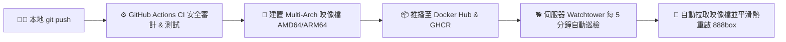

# 888box

[](https://hub.docker.com/r/tbdavid2019/888box)
[](https://github.com/tbdavid2019/888box/actions)
[](LICENSE)
[](https://hub.docker.com/r/tbdavid2019/888box/tags)


一款專業級、輕量化、全方位的多媒體與文件統一託管平台。採用現代 **Bento Grid** 介面，將「圖片」、「影片」、「音訊」與「文件」無縫整合，兼具企業級 SSRF 安全防護、真實點擊分析、密碼存取門禁與 Podcast RSS 自動同步。原生支援 Model Context Protocol (MCP) 與 WebMCP，為次世代 AI 代理人提供隨插即用的資產託管與檢索服務。

---

## ✨ 核心功能亮點

### 🚀 跨類型全能智慧上傳區 (Smart Universal Dropzone)
- **首頁一站式託管**：首頁直接提供全能拖曳與剪貼簿 (`Ctrl+V`) 智慧上傳區，無須切換頁面。
- **自動格式辨識**：前端自動分析 MIME Type 與副檔名，智慧分類為圖片 🖼️、影片 🎬、音訊 🎙️ 或文件 📂。
- **即時進度與一鍵分享**：百分比動態進度條、一鍵複製 `/v/{token}` 美化短連結與預覽按鈕，實時連動首頁資產統計。

### 🖼️ 圖片託管中心
- **極速上傳與壓縮**：支援拖曳、剪貼簿貼上上傳，具備強大的圖片壓縮與 WebP 格式轉換。
- **智慧方向與 Exif 管理**：自動校正 JPEG 方向，保留或按需移除 Exif 隱私資訊。

### 🎬 影片與 Podcast 系統
- **自動化 iTunes RSS**：上傳影片後自動生成相容 iTunes 的 Podcast RSS (`storage/podcast.xml`)，支援主流播客 App 訂閱。
- **自動 MetaData 提取**：內建 FFmpeg 自動擷取影片時長、解析度、碼率，並於第 1 秒處自動生成預覽縮圖封面。

### 🎙️ 音訊與播客大廳
- **專業級音訊託管**：支援 `mp3`, `wav`, `aac`, `ogg`, `m4a`, `flac` 等格式，自動生成獨立音訊 Podcast Feed (`storage/podcast_audio.xml`)。
- **黑膠 CD 動態播放器**：整合 HTML5 音訊播放器，配備隨播放狀態動態旋轉的仿實體 CD 唱盤視覺特效。

### 📂 文件託管與安全預覽
- **多格式萬用支援**：支援 ZIP, PDF, Word, Excel, Visio, EPUB 等多種文件格式。
- **安全文字預覽**：`.txt`、`.md`、`.json`、`.csv`、`.log`、`.yaml` 可在分享頁直接閱讀（預覽上限 2 MB，超額自動降級為下載）。
- **EPUB 線上閱讀器**：內建 `epub.js` 閱讀器，透過本站授權預覽端點讀取，免除外部儲存跨域（CORS）限制。

### 🛡️ 企業級安全與點擊分析
- **Google Magika AI 內容辨識**：容器內建 Google Magika 深度學習模型（毫秒級本地離線推論），零信任副檔名，精準阻擋偽裝成圖片或文件的惡意腳本與可執行檔（PHP, Shell, ELF, PEbin, WASM 等）。
- **全面 SSRF 防禦體系**：遠端 URL 拉取嚴格阻斷本機迴路（Loopback）、私有內部網段（10.x, 172.16-31.x, 192.168.x）與雲端 Metadata 服務（`169.254.169.254`）。
- **目錄遍歷與上傳防護**：文件副檔名強制白名單比對，資產刪除嚴格限制於 `storage/` 邊界內，`storage/.htaccess` 徹底禁止執行 PHP 腳本。
- **存取密碼門禁 (Gatekeeper)**：支援為單一資源設定存取密碼，透過毛玻璃 UI 進行授權驗證；密碼保護之資源自動自公開 Podcast RSS 隱藏。
- **真實點擊分析**：基於裝置持久標記追蹤每筆資產的真實造訪次數，並具備即時檢舉違規系統。

### 🤖 AI 代理人原生整合 (AI Agent Ready)
- **標準動態 `/llms.txt` (`llms.php`)**：遵循 [llmstxt.org](https://llmstxt.org/) 標準規範，提供結構化 Markdown 網站索引與 API 導覽。
- **動態技能指南 (`skill.php`)**：為 AI 代理人提供動態生成的指令文檔，自動識別 Base URL 並在登入狀態下注入 Token。
- **MCP & WebMCP 雙模伺服器 (`mcp.php` / `/mcp`)**：符合 Model Context Protocol (MCP) 與 W3C / Chrome 146+ WebMCP 標準，支援 **CLI stdio** 與 **HTTP JSON-RPC 2.0** 雙模通訊。
- **RFC 9727 API 目錄 & 發現標頭**：發布 `/.well-known/api-catalog` 與 RFC 8288 `Link` 標頭，供 Agent 自動探測端點。

---

## 🐳 Docker 快速啟動 (推薦)

888box 官方映像檔已發布至 Docker Hub 與 GitHub Container Registry，支援 **Multi-Arch（`linux/amd64` 與 `linux/arm64`，完全相容 AWS Graviton 與 Apple Silicon）**。

### 方式一：Docker Compose（含 Watchtower 自動看門狗，強烈推薦）

本方案包含 `888box` 核心服務與 `watchtower` 自動更新容器。當遠端映像檔更新時，Watchtower 會自動為您平滑熱重啟，達到無人值守的 CI/CD 效果。

建立 `docker-compose.yml`：

```yaml
services:
  888box:
    image: ${DOCKER_IMAGE:-tbdavid2019/888box:latest}
    build: .
    container_name: 888box
    restart: unless-stopped
    ports:
      - "6767:80"
    volumes:
      - ./storage:/var/www/html/storage
      - ./.env:/var/www/html/.env
    environment:
      TZ: Asia/Taipei
    labels:
      - "com.centurylinklabs.watchtower.enable=true"
      - "com.centurylinklabs.watchtower.scope=888box"

  watchtower:
    image: containrrr/watchtower:latest
    container_name: watchtower-888box
    restart: unless-stopped
    environment:
      DOCKER_API_VERSION: "1.44"
      WATCHTOWER_SCOPE: "888box"
      WATCHTOWER_POLL_INTERVAL: 300
      WATCHTOWER_CLEANUP: "true"
    volumes:
      - /var/run/docker.sock:/var/run/docker.sock
```

啟動服務：

```bash
# 準備儲存目錄與設定檔
mkdir -p storage && cp .env.example .env

# 一鍵啟動
docker compose up -d
```

> **提示**：若伺服器對 Docker Hub 連線有路由限制，可在 `.env` 中加入 `DOCKER_IMAGE=ghcr.io/tbdavid2019/888box:latest`，即可直接改由 GitHub Container Registry 拉取。

---

### 方式二：直接使用 `docker run` 指令

```bash
# 1. 建立本機持久化目錄與環境檔
mkdir -p storage
cp .env.example .env

# 2. 啟動容器
docker run -d \
  --name 888box \
  -p 6767:80 \
  -v $(pwd)/storage:/var/www/html/storage \
  -v $(pwd)/.env:/var/www/html/.env \
  --restart unless-stopped \
  tbdavid2019/888box:latest
```

---

### 方式三：一鍵互動式腳本 (原生初始化與管理員設定)

若你是第一次安裝，推薦使用隨附的互動式安裝腳本，會一步一步引導設定管理員帳號與儲存後端：

```bash
git clone https://github.com/tbdavid2019/888box.git
cd 888box
./install.sh
```

**腳本功能亮點：**
1. 自動檢查 Docker 環境。
2. 自動初始化 `storage/` 並設定正確的 `www-data` (UID 33) 讀寫權限。
3. 自動依 `.env.example` 產生正式 `.env`。
4. 自動啟動容器並由 `config/schema.php` 自動建立核心資料庫 Schema。
5. 互動式建立第一位超級管理員帳號與密碼。

---

## 🔄 CI/CD 與自動化看門狗流程

本專案建置了完全閉環的自動化 CI/CD 架構：



- **多架構原生支援**：GitHub Actions 自動建置 `linux/amd64` 與 `linux/arm64`，各種伺服器皆能下載最佳效能的專屬架構層。
- **多實例隔離安全**：透過 `WATCHTOWER_SCOPE=888box`，Watchtower 僅鎖定監控 888box 容器，不會影響或重啟同主機上的其他服務。
- **資料持久化保證**：所有上傳檔案與 SQLite 資料庫均透過 Volume 掛載至宿主機 `./storage`，映像檔換新時資料絕對零遺失。

---

## ⚙️ 儲存後端設定 (.env)

888box 支援「本地儲存」、「AWS S3」、「阿里雲 OSS」與「又拍雲 UpYun」。

### AWS S3 / CloudFront 配置範例
```ini
STORAGE_TYPE=s3
S3_ACCESS_KEY_ID=your_access_key
S3_ACCESS_KEY_SECRET=your_secret_key
S3_BUCKET=your_bucket_name
S3_REGION=ap-northeast-1
S3_ENDPOINT=https://s3.ap-northeast-1.amazonaws.com
S3_CDN_DOMAIN=https://your-cloudfront-id.cloudfront.net
S3_ACL=public-read
```

> **S3 自動建置腳本**：若需快速建立符合安全規範與公開讀取 Policy 的 AWS S3 Bucket，可直接執行 `./setup_s3.sh`。

---

## 🔒 權限與重要維護注意事項

### 1. SQLite 檔案與目錄權限 (避免 500 錯誤)
容器內 Apache / PHP 以 `www-data`（UID/GID 33）執行。SQLite 在執行寫入與建立 WAL 日誌時，**資料庫檔案及其上層目錄 `storage/` 必須具備 `www-data` 的寫入權限**。
若在宿主機以 root 操作導致檔案擁有者改變，請在宿主機執行以下指令修正：

```bash
sudo chown -R 33:33 ./storage
```

### 2. 手動建立或重設管理員帳號
若未透過 `install.sh` 建立帳號，可隨時透過以下指令建立管理員（請替換 `YOUR_USER` 與 `YOUR_PASS`）：

```bash
docker exec -it 888box php -r "$u='YOUR_USER'; $p='YOUR_PASS'; $pdo = new PDO('sqlite:/var/www/html/storage/database.db'); $h = password_hash($p, PASSWORD_DEFAULT); $t = bin2hex(random_bytes(16)); $stmt = $pdo->prepare('INSERT OR REPLACE INTO users (username, password, token) VALUES (?, ?, ?)'); $stmt->execute([$u, $h, $t]); echo \"User $u created.\n\";"
```

### 3. 查看每日上傳額度
```bash
docker exec -it 888box php -r '$pdo = new PDO("sqlite:/var/www/html/storage/database.db"); echo $pdo->query("SELECT value FROM configs WHERE key = '\''max_uploads_per_day'\'' LIMIT 1")->fetchColumn(), PHP_EOL;'
```

---

## 🛠️ 開發與架構說明

- **後端環境**：PHP 8.1+ (Apache Prefork, pdo_sqlite, gd, imagick, exif, fileinfo)
- **前端架構**：原生 Vanilla ES Modules，整合 100% 離線向量圖示庫 Lucide Icons
- **本機資料庫**：SQLite 3（存放於 `storage/database.db`，由 `config/schema.php` 自動維護核心 Schema）
- **多媒體處理**：FFmpeg & ImageMagick（容器內建）
- **詳細變更歷史**：請參閱 [CHANGELOG.md](CHANGELOG.md)

---

## 📄 授權協議

本專案採用 AGPL-3.0 授權協議。詳見 [LICENSE](LICENSE) 檔案。
